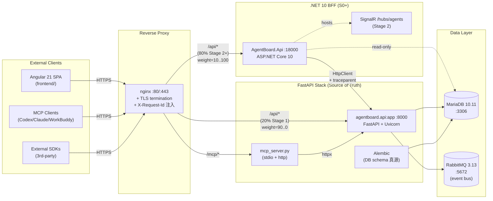
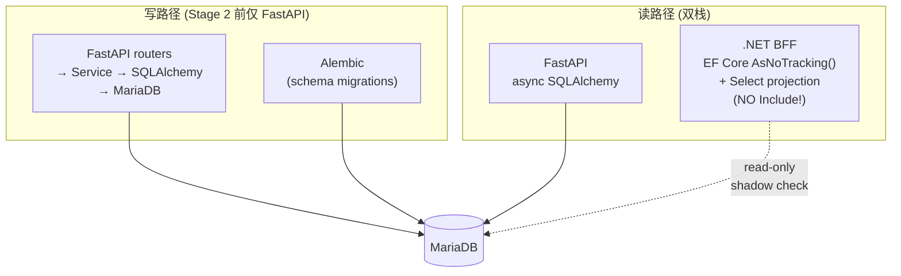
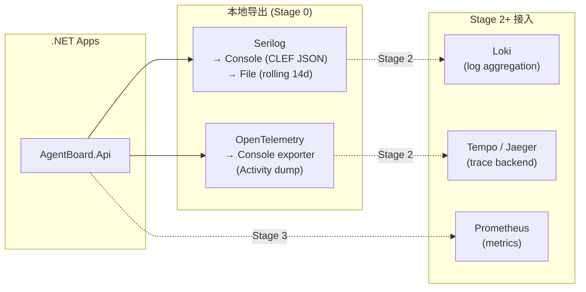
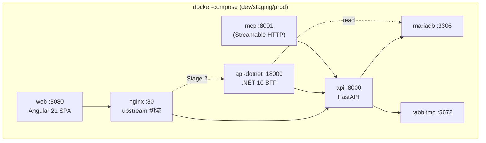

# AgentBoard Architecture v2 — Dual-Stack BFF

> v2 在 2026-08 启动，从 FastAPI 单体演进为「双栈 BFF」。
> 本文档是精简版架构图与边界说明，**完整设计见
> [`openspec/changes/dual-stack-bff-restructure/design.md`](../openspec/changes/dual-stack-bff-restructure/design.md)**。

## 1. 目标演进

```
v1 (2024-2026Q2)         v2 (2026Q3-)              v3 (2027+)
┌────────────┐           ┌──────────────┐           ┌──────────────┐
│  FastAPI   │           │  .NET 10     │           │  .NET 10     │
│  单体      │    →      │  BFF (80%)   │    →      │  唯一对外    │
│  (web+mcp) │           │  FastAPI 内  │           │  FastAPI 退  │
│            │           │  部 AI 服务  │           │  出公网      │
└────────────┘           └──────────────┘           └──────────────┘
```

**核心原则**：
- 公开 REST 契约**冻结**，由 FastAPI 真源控制。
- .NET 10 BFF 是「API Gateway + 业务路由器 + 未来 SignalR 宿主」。
- FastAPI 退守为「AI 子系统 + 复杂业务内部接口」，不直接对外。
- 数据库仍由 FastAPI Alembic 管控（真源），.NET 端**只读连接**做契约影子比对。

## 2. 双栈架构图



> **Stage 0 状态**：nginx 仍 100% 走 FastAPI；.NET 端只跑 `/api/health` + `/api/meta` 做契约影子。
> 切流发生在 Stage 2 灰度阶段，由 `scripts/cutover.ps1` 控制 nginx upstream 权重。

## 3. Feature 归属矩阵

| Feature | FastAPI（真源） | .NET 10 BFF | 备注 |
|---|:-:|:-:|---|
| `/api/health` | ✅ | ✅ | 双栈 1:1 兼容（Stage 0 完成） |
| `/api/meta` | ✅ | ✅ | 双栈 1:1 兼容（Stage 0 完成） |
| Auth (login/register/me) | ✅ | 计划中 | Stage 1 第一批 |
| Projects CRUD | ✅ | 计划中 | Stage 1 |
| Epics / Stories | ✅ | 计划中 | Stage 1 |
| Tasks / Bugs | ✅ | 计划中 | Stage 1+ |
| Comments / Attachments | ✅ | 计划中 | Stage 1+ |
| Webhooks | ✅ | 计划中 | Stage 2 接管分发 |
| Notifications | ✅ | 计划中 | Stage 2 |
| **SignalR /hubs/agents** | ❌ | ✅ | **Stage 2 全新**（.NET 优势） |
| MCP (stdio + http) | ✅ | ❌ | FastAPI 持续维护 |
| Background Workers | ✅ | 计划中 | Stage 3 共存，最终全 .NET |
| AI subsystems (Llm / Proposal / etc.) | ✅ | ❌ | 永远 FastAPI |

## 4. 数据访问边界



**关键约束**：
- .NET 端 EF Core **永远不写**（Stage 0/1），只读连接 + `AsNoTracking()`。
- 表结构变更必须由 Alembic 管控；.NET 端 `dotnet ef migrations add` 仅作为本地影子比对，**不 apply**。
- 双栈的查询结果必须 1:1 一致（由契约测试守护）。

## 5. 可观测性



**请求关联字段**（每个请求自动注入）：
- `X-Request-Id` — 应用层 ID（`RequestIdMiddleware` 注入 + echo）
- `traceparent` — W3C Trace Context（`TraceContextMiddleware` 注入）
- `trace_id` / `span_id` — Serilog 自动从 `Activity.Current` 提取（`TraceContextEnricher`）

跨栈 trace：.NET 调 FastAPI 时透传 `traceparent`，FastAPI 端（OpenTelemetry 同规格）继续同一 trace。

## 6. 安全

- 公开契约冻结，禁止 .NET 端擅自加 endpoint；新端点必须先改 FastAPI + 同步 OpenAPI 快照。
- Bearer Token 沿用 FastAPI 体系（`v1.<payload>.<sig>`），.NET 端用 `AgentBoardFastApiClient` 透传到 FastAPI 验证。
- API Key 格式 `abk_<digest>` 同 FastAPI。
- `Production` env 启动时强制：`AGENTBOARD_SECRET` ≥ 32 字节 / `REQUIRE_AUTH=1` / CORS 白名单 / 强制 HTTPS。

## 7. 部署形态



每个服务一个容器；`api-dotnet` 与 `api` 共享 `mariadb` 网络但只有 `api` 写，`.NET` 只读。

## 8. 与 v1 的关键差异

| 维度 | v1（FastAPI 单体） | v2（双栈 BFF） |
|---|---|---|
| 公开入口 | FastAPI | .NET 10（Stage 2+） |
| 内部 AI 服务 | FastAPI | FastAPI（保留） |
| 实时推送 | WebSocket 自定义 | SignalR（Stage 2） |
| 类型契约 | Pydantic | OpenAPI 快照 + NSwag 强类型客户端 |
| 数据访问 | SQLAlchemy 全栈 | FastAPI 写 / .NET 只读（Stage 1） |
| 部署单元 | 单 FastAPI 容器 | 5+ 容器编排 |
| 监控 | 文本日志 | CLEF JSON + OpenTelemetry（Stage 0+） |
| 跨语言 | Python only | Python + C# 双栈 |

## 9. 阶段路线

| Stage | 关键交付 | 状态 |
|---|---|---|
| **0** | 脚手架 + 契约冻结 + health/meta + docker-compose + Serilog/OTel | ✅ done (commit `ac6f623`~`6de19b4`) |
| 1 | 只读业务迁 .NET（GET 端点：projects/epics/stories/tasks） | backlog |
| 2 | 写迁 .NET + Webhooks/Notifications/SignalR + 灰度切流 | backlog |
| 3 | FastAPI 业务 router 下架，FastAPI 内部化为 AI service | backlog |

详细任务清单：[`openspec/changes/dual-stack-bff-restructure/tasks.md`](../openspec/changes/dual-stack-bff-restructure/tasks.md)。

## 10. 相关文档

- [`docs/dual-stack-bff-runbook.md`](dual-stack-bff-runbook.md) — 运维手册（30 分钟跑通 + 切流 + 回滚 + FAQ）
- [`docs/contracts/contract-freeze.md`](contracts/contract-freeze.md) — 契约冻结规则
- [`openspec/changes/dual-stack-bff-restructure/proposal.md`](../openspec/changes/dual-stack-bff-restructure/proposal.md) — 改造提案
- [`openspec/changes/dual-stack-bff-restructure/design.md`](../openspec/changes/dual-stack-bff-restructure/design.md) — 完整架构设计
- [`dotnet/README.md`](../dotnet/README.md) — .NET 端规约
