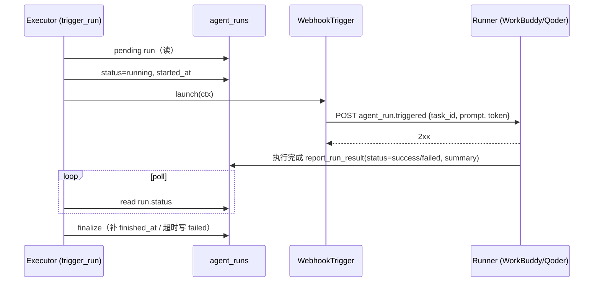

# Design — 模式 B：Trigger（Webhook 唤醒 Runner）

**status**: in_review

## 架构决策

### 1. 事件负载结构（`WebhookTrigger.build_payload`）

与既有 `fire_webhook` 事件生态同构（`{event, timestamp, data}`）：

```json
{
  "event": "agent_run.triggered",
  "timestamp": "1739000000",
  "data": {
    "run_id": 1, "task_id": 2, "project_id": 3, "schedule_id": 4,
    "agent": "workbuddy",
    "task_title": "...", "task_spec": "...",
    "prompt": "<build_prompt 输出：title + spec + 记忆 + 验收>",
    "token": "<env AGENTBOARD_TRIGGER_TOKEN，非 admin scoped token>"
  }
}
```

Runner 被叫醒后**直接拿 `task_id` 执行**（不再全量 `list_tasks` 轮询），
`token` 供其回调 AgentBoard（scoped 权限，非 admin）。

### 2. 目标 URL 解析（`resolve_url`）

```
env AGENTBOARD_TRIGGER_URL  >  ctx.extra["webhook_url"]（项目级 WebhookConfig）
```

- env 覆盖：测试注入 Fake server / 全局运维统一配置；
- DB 兜底：`build_run_context` 按 project_id 查 enabled 的 `WebhookConfig`
  首个，写入 `ctx.extra["webhook_url"]` / `["webhook_secret"]`——复用既有
  `create_webhook` 基础设施，零新表、零 REST 契约变更。

### 3. 签名（`launch`）

配置了 secret 时附加 `X-AgentBoard-Signature`（HMAC-SHA256 of body）+
`X-AgentBoard-Timestamp`，与 `service.fire_webhook` 完全一致的签名模式，
Receiver 侧可复用同一套验签逻辑。

### 4. 完成判定（`poll_status` + `trigger_run` 轮询）

Trigger 场景完成信号来自**外部**（Runner 经 `report_run_result` 回写），
执行器无法用子进程退出码判定。因此：

- `WebhookTrigger.poll_status` 继承 `TriggerAdapter` 默认语义：保持当前状态，
  等待显式变更；
- `trigger_run` 主循环**轮询 DB `run.status`**（每次新 session 读取，感知
  外部提交），终态（success/failed/cancelled）或超时即退出并 finalize
  （补写 `finished_at`）。

与 `launch_run`（轮询 RunHandle/进程）形成对称：Launcher 完成判定在进程，
Trigger 完成判定在 DB。

### 5. 注册表别名共享（`preserve_name`）

`register_adapter` 新增 `preserve_name: bool = False` 参数：默认 False 保持
既有语义（显式 name 回写 `cls.name`，Story 101 测试依赖）；为 True 时不回写。
`WebhookTrigger` 类定义 `name = "webhook"`（逻辑名），以
`register_adapter(WebhookTrigger, name="workbuddy", preserve_name=True)` 方式
注册别名，避免第二次注册把类名覆盖成 `qoder`。

## 交互流程（单次触发）



## 失败路径

| 场景 | 处理 |
|---|---|
| 无目标 URL（无 env 无项目级 WebhookConfig） | `resolve_url` 抛 `AdapterError` → run failed（可读错误） |
| POST 网络异常 | `AdapterError("webhook POST failed: ...")` → run failed |
| 非 2xx 响应 | `AdapterError("webhook returned {code}: ...")` → run failed |
| 外部超时不回写 | `max_poll_seconds` 到期 → run failed(timeout)，`finished_at` 回写 |
| agent 不在 `TRIGGER_AGENTS` | `trigger_run` 返回 None（提示应走 `launch_run`），不误触发 |

## 兼容性

- 零 REST 契约变更、零 DB 表变更、零既有行为变更（`register_adapter` 新参数
  默认 False 向后兼容）；
- `fire_webhook` / `WebhookConfig` 原样复用；
- 不触碰端口 18001 / 18000 / 28080 相关配置。
