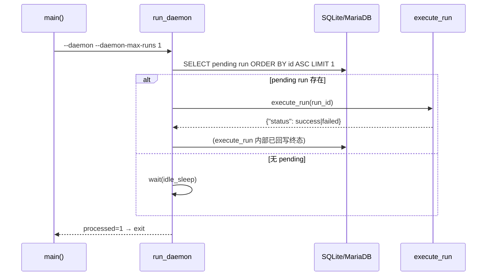

# Design — Executor 常驻 daemon 模式

**status**: in_review

## 现状（改动前）

```
CLI main()
 ├─ --run <id>         → launch_run()          单次：认领 pending → running → 回写
 ├─ --once             → launch_first_pending() 单次：第一个 pending
 ├─ --trigger <id>     → trigger_run()          单次：webhook 触发
 ├─ --trigger-once     → trigger_first_pending()单次：第一个 trigger-agent pending
 └─ --execute <id>     → execute_run()          单次：统一状态机（Story 104）
```

无任何「持续扫描 pending → 逐个驱动」的常驻循环；每次进程启动只能处理一个 run。

## 目标架构（改动后）

```
CLI main()
 └─ --daemon [--daemon-poll-interval N] [--daemon-idle-sleep N] [--daemon-max-runs N]
      └─ run_daemon(session_factory, *, poll_interval, idle_sleep, max_runs, stop_event)
           loop {
             stop_event.is_set()?  → 优雅退出
             processed >= max_runs? → 退出（max_runs=None 无限）
             取 id 升序第一个 pending AgentRun
             └─ execute_run()  ──► 已自动分派：TRIGGER_AGENTS → WebhookTrigger
                                  其余 agent → LauncherAdapter（mode A/B）
             execute_run 抛异常 → 该 run 兜底标记 failed，continue（不拖垮循环）
             无 pending → stop_event.wait(idle_sleep)（可被唤醒）或 time.sleep
           }
```

## 关键决策

| 决策点 | 选择 | 理由 |
|---|---|---|
| 复用 `execute_run` | 是 | 状态机/分派/外部回写感知已完备，daemon 只做「循环认领」，职责单一 |
| `max_runs` 参数 | 提供（默认 None） | 单次验收/测试可界定边界；`0` = 立即退出冒烟 |
| 退出信号 | `stop_event` + KeyboardInterrupt | 测试可控（threading.Event）+ 生产 Ctrl+C 优雅退出；两者均置 `stopped=True` |
| 空闲等待 | `stop_event.wait(idle_sleep)` | 无事件时等效 sleep；事件置位立即唤醒，避免最多等一个 idle 周期 |
| 单 run 异常 | 捕获 → `service.update_run(failed)` → 继续 | 常驻进程绝不能被一个 run 拖死（daemon 可用性 > 单次结果） |
| 返回 | `{"processed", "last_status", "stopped"}` | CLI 打印便于验收脚本断言 |

## 交互序列（一次循环迭代）



## 变更文件

- `agentboard/executor.py`：+`run_daemon()`；CLI +`--daemon*` 4 参数（增量）
- `tests/test_epic78_story177_daemon.py`：单测（5 用例）
- `tests/test_epic78_story177_daemon_e2e.py`：E2E（1 用例）

## 风险与规避

- **测试无限循环**：idle 分支若忘传 `stop_event` 会无限 sleep → 单测必须显式传
  `stop_event=Event()` 并由 Timer 置位（本批次已踩坑修复：漏传导致挂死）。
- **跨进程 SQLite 锁**：CLI 子进程与 pytest 父进程共享同一 DB 文件会写锁卡死 →
  CLI 子进程测试用 `--daemon-max-runs 0`（不触碰 DB）规避；真实处理走 E2E 独立临时库。
- 不触碰 18001 / 18000 / 28080；零 REST/DB 契约变更。
