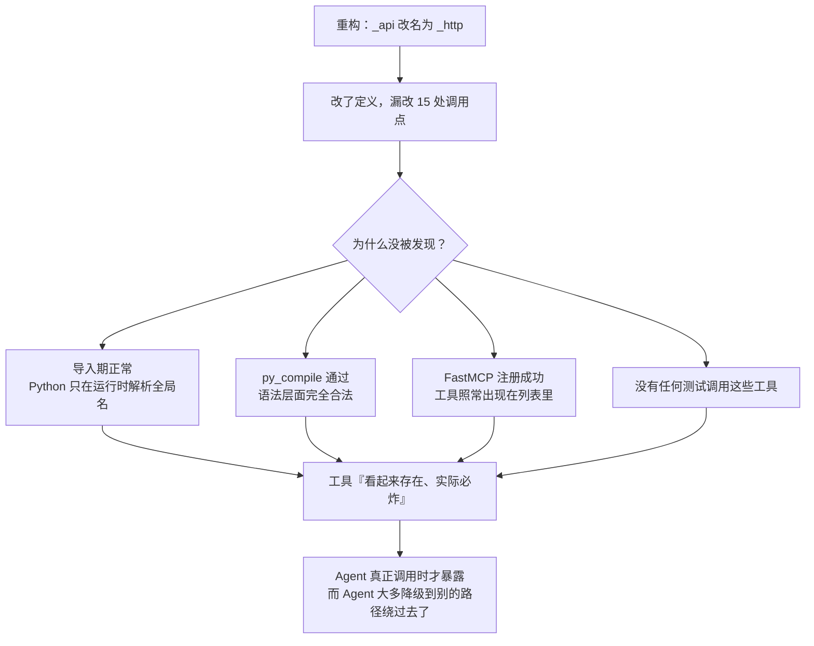
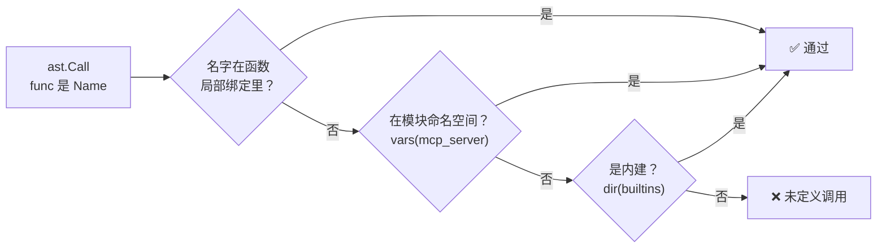
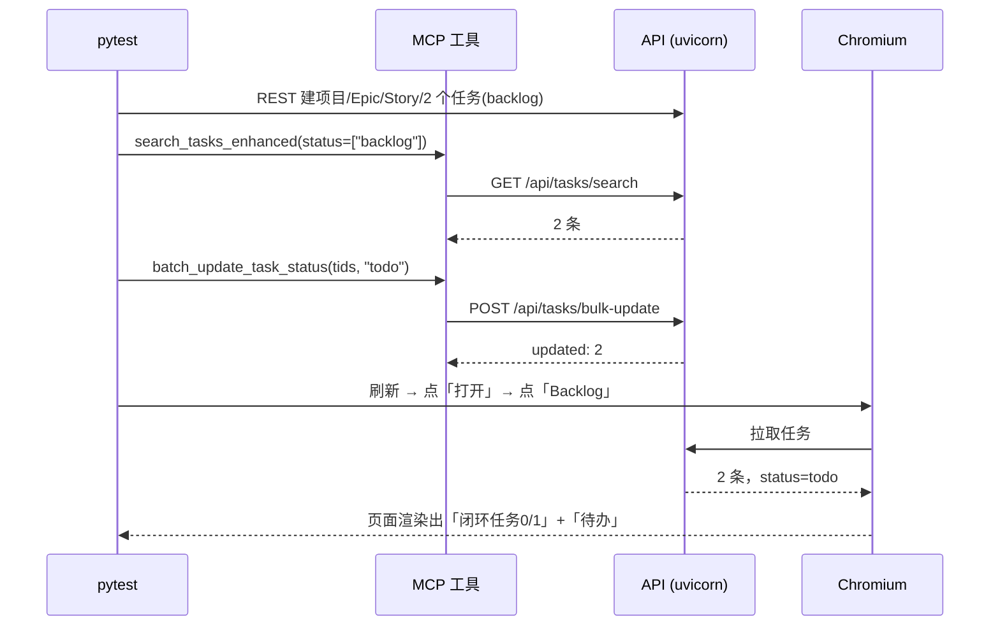

# Design: MCP 工具可用性修复与回归护栏（Epic 97 P0）

## 1. 问题定性：这不是「一个 bug」，是一类缺陷

单纯把 15 处 `_api` 改成 `_http` 只需要一次批量替换，五分钟就能收工。但那样做等于承认「下次同样的事情还会再发生一遍」。

值得先问一句：**为什么这个缺陷能活这么久？**



关键在最后一环：Agent 遇到工具报错往往会自动改用别的手段（比如直接走 REST），**缺陷被"绕过"而不是被"暴露"**。这正是它能潜伏至今的原因。

所以本次设计的重点不在修复本身，而在**让同类缺陷下次在 CI 里就死掉**。

## 2. 方案选型：怎么防住「未定义调用」

| 方案 | 做法 | 优势 | 劣势 | 结论 |
|---|---|---|---|---|
| A. 引入 ruff / pyflakes | 交给成熟 linter 的 F821 规则 | 零维护、覆盖全仓库 | 引入新依赖 + 全仓库存量告警需要先清理，本次改动会被淹没；CI 尚未接 lint 环节 | ❌ 本轮不做，列为后续 |
| B. 冒烟调用每个工具 | 测试里挨个真调 | 贴近真实、能顺带验证契约 | 慢（需起服务）；新增工具容易漏测 | ✅ 作为**第二层** |
| C. AST 静态扫描 | 解析源码，逐个解析调用名 | 毫秒级、无外部依赖、对新增代码自动生效 | 只覆盖 `Name` 形式调用，属性调用需另解 | ✅ 作为**第一层** |

最终选 **C + B 双层**：C 兜住「所有调用名可解析」这个不变量，B 兜住「路径前缀与传参方式正确」这类静态查不出的语义问题。A 记为后续独立事项，不与本次修复耦合。

## 3. 第一层：AST 静态护栏

核心是判断「一个调用名能否解析」。作用域规则要处理对：



局部绑定的收集必须完整，否则会产生假阳性。覆盖：参数（含 posonly / kwonly / `*args` / `**kwargs`）、赋值、增量赋值、海象运算符、`for` / `with` / `except` 目标、推导式变量、嵌套 `def` / `class`、`import` 别名。

**为什么用 `vars(mcp_server)` 而不是再解析一遍模块顶层定义？**
因为模块里存在 `from . import auth`、`import httpx` 等间接引入的名字，以及装饰器可能改写的绑定。直接取真实导入后的命名空间，比静态推断更准确，也更简单。

**已知边界**：只覆盖 `foo(...)` 形式，不覆盖 `obj.method(...)`。属性调用的解析需要类型推断，成本远高于收益，交给第二层的真实调用来兜。这个取舍在测试注释里写明了。

此外补两条更"钉死"的窄断言，作为廉价的双保险：
- `test_no_legacy_api_helper_references`：直接禁止 `_api(` 这个具体名字复活。
- `test_http_helper_callers_use_absolute_api_paths`：所有 `_http` 字面量路径必须以 `/api` 开头（f-string 取首个字面量片段判断）。

## 4. 第二层：真实栈集成

沿用 `test_epic96_p0_proposals.py` 已验证的模式：**真实 uvicorn 子进程 + httpx**，而非进程内 `TestClient`。

> 原因：`api.py` 的 `audit_log_middleware` 基于 `BaseHTTPMiddleware` 且会 `await request.body()`，在 TestClient 下会与下游端点争抢 receive 通道导致请求挂死。这个坑在 `test_backend_flow.py` 时代就踩过一次，不要重蹈。

把 `mcp_server.API_URL` 指向这个临时栈、把登录 token 塞进 `AGENTBOARD_MCP_TOKEN`，就能让 MCP 工具函数打到真实服务上。测试结束后在 `finally` 里恢复原值，避免污染同进程的其它测试。

断言分两层：
- `_assert_no_transport_error()` 统一拦截 `NameError` / `Not Found`（路径前缀错）/ `Method Not Allowed` / `Field required`（body 没传对）这四类传输层症状；
- 各工具再按自身语义断言返回结构，并对有副作用的操作**回查 REST 确认真的落库**（比如批量改状态后 `GET /api/tasks/{id}` 必须是 `todo`，批量删除后必须 404）。

多值过滤单独立一个用例，用「多值结果 ⊇ 各单值结果之并」来钉死 OR 语义 —— 这条断言在修复前的死代码下必然失败。

## 5. 护栏有效性反向验证

写完护栏必须回答：**它真的能抓到这次的 bug 吗？**

做法是把 `_MCP_SOURCE` 临时指向 `git show HEAD:agentboard/mcp_server.py` 导出的修复前源码，重跑静态护栏：

```
[OK 已拦截] test_no_undefined_global_calls_in_mcp_server | _api 命中数: 15
[OK 已拦截] test_no_legacy_api_helper_references         | _api 命中数: 1
```

**精确命中 15 处**，与人工排查的数量完全吻合。护栏有效性得证。

（第三条 `/api` 前缀断言在修复前源码上未触发，这是正确行为：那些路径当时走的是 `_api` 而非 `_http`，不在该断言的管辖范围内。）

## 6. E2E：证明闭环真的通了

单元与集成测试证明「工具不炸」，但自动开发闭环真正的价值主张是「**MCP 写入 → Web 可见**」。E2E 用一条链路把它焊死：



最后那个「待办」断言是整条链路的关键证据：它只可能来自 MCP 工具写入的 `todo` 状态。修复前这一步会在 `batch_update_task_status` 处直接 `NameError`，根本走不到浏览器。

### 两个 SPA 交互坑

1. **不能用深链 `goto`**。`/projects/{id}` 并非有效路由（实际是 `/project/{id}` 单数），且 SPA 假路由对 `goto` 存在已知的 `tasks()` 信号竞态。改用**点击导航**：`打开` → 项目页 → `Backlog` 标签页。
2. **登录后新建的数据不会自动出现**。测试是先登录再建项目，仪表盘不会感知，必须 `page.reload()` 一次。首次跑挂在这里，值得记一笔。

## 7. 顺带修掉的回归信号噪音

`test_crud_smoke.py` 硬编码 `http://localhost:8000` 且依赖外部常驻服务。当前 Docker 栈映射的是 18000（8000 段在本机属 Windows 保留端口范围），于是它在本地稳定产出 **9 个 ConnectError 失败**。

这类噪音的危害在于：真回归混进来也看不出来。改为：

```python
BASE = os.getenv("AGENTBOARD_SMOKE_BASE", "http://localhost:8000")
pytestmark = pytest.mark.skipif(not _api_reachable(), reason=...)
```

依赖外部服务的测试，在服务缺席时应当 **skip 而非 fail** —— fail 表达的是「代码有问题」，skip 表达的是「这次没验」，语义必须准确，否则回归信号就废了。

修改后同一组测试：`9 failed, 11 passed` → `11 passed, 10 skipped`。

## 8. 部署决策

本次改动位于 MCP 服务进程内，正常流程应当 `docker cp` + `docker restart agentboard-mcp-1`。

**本轮明确不做。** 该容器映射 18001 端口，正被 WorkBuddy 自身用于 MCP 通信，重启会切断连接、导致后续自动化全部失效。

这不影响交付质量：集成测试与 E2E 都是自起 uvicorn 的自包含验证，不依赖该容器；源码修复已提交。容器部署留给独立的运维窗口执行。
